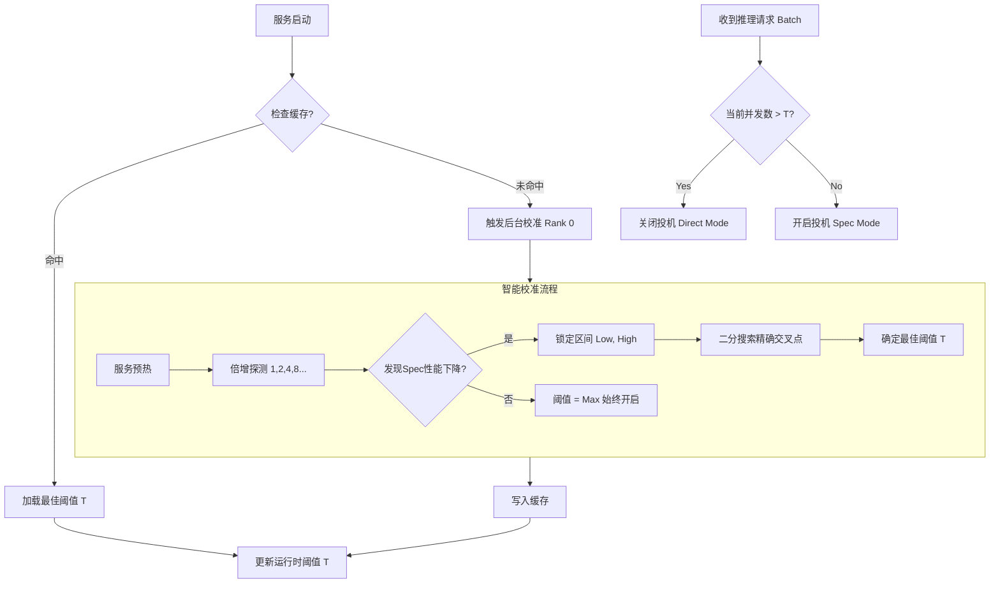

# 自适应投机解码 (Adaptive Speculative Decoding)

自适应投机解码是一种智能优化技术，能够根据当前系统负载动态调整投机解码策略，在高并发场景下自动关闭投机推理以消除额外计算开销，在低并发场景下充分利用投机解码加速推理。

## 背景与动机

投机解码（Speculative Decoding）通过小模型生成候选 token，再由大模型验证，可以显著降低推理延迟。然而，投机解码在高并发场景下会引入额外开销：

- **内存带宽压力**：额外的草稿 token 生成会增加内存访问
- **计算资源竞争**：多个请求同时执行投机解码时，草稿模型的计算会与大模型的验证竞争 GPU 资源
- **批处理效率下降**：高并发时，投机解码的 overhead 可能抵消甚至超过其带来的收益

自适应投机解码通过动态阈值机制解决这一问题。

## 核心方案

### 1. 动态启停 (Dynamic Switching)

在 `SuffixDecodingProposer.generate_token_ids` 中植入检查逻辑，实时监控并发请求数 (`num_reqs`)。

**触发逻辑**：

```python
if current_num_reqs > adaptive_threshold:
    # 高并发：软关闭投机推理
    return empty_draft_tokens  # 直接返回空草稿，跳过投机步骤
else:
    # 低并发：正常执行投机解码
    return generate_speculative_tokens()
```

**效果**：当并发超过阈值时，系统自动退化为标准解码模式，消除投机解码的额外开销。

### 2. 智能校准 (Smart Calibration)

传统的手动调参方式效率低下，智能校准采用算法自动寻找最优阈值。

#### 2.1 倍增探测 + 二分搜索 (Doubling Probe + Binary Search)

**第一阶段 - 倍增探测**：
以指数级步长快速扫描并发空间，定位性能交叉区间。

```
并发级别: 1 → 2 → 4 → 8 → 16 → 32 → ...
         ↓    ↓    ↓    ↓     ↓     ↓
   测量 TPS_spec 与 TPS_direct
```

**性能交叉点判定**：
当 `TPS_spec < TPS_direct × (1 - β)` 时，认为发现交叉点，其中 β 为容忍系数（默认 5%）。

**第二阶段 - 二分搜索**：
在锁定的区间 `[Low, High]` 内进行精确查找，收敛到个位数并发值。

```
初始区间: [8, 16]  （假设在并发 8 和 16 之间发现交叉）
第 1 轮: 测试并发 12 → TPS_spec < TPS_direct? 是 → 新区间 [8, 12]
第 2 轮: 测试并发 10 → TPS_spec < TPS_direct? 否 → 新区间 [10, 12]
第 3 轮: 测试并发 11 → TPS_spec < TPS_direct? 是 → 最终阈值 T = 10
```

#### 2.2 统计显著性检验

引入变异系数 (Coefficient of Variation, CV) 确保测量稳定性：

$$
CV = \frac{\sigma}{\mu} = \frac{\sqrt{\frac{1}{n}\sum_{i=1}^{n}(TPS_i - \bar{TPS})^2}}{\bar{TPS}}
$$

**通过标准**：$CV < 0.15$（即 TPS 波动小于 15%）

**作用**：排除系统噪音干扰，确保校准结果的可靠性。

### 3. 自动缓存 (Auto Caching)

实现 `CalibrationCache` 类，避免重复校准。

**缓存指纹生成**：

$$
Fingerprint = Hash(ModelName, TP_{size}, K_{spec}, MaxSeqs)
$$

其中：
- $ModelName$: 模型名称
- $TP_{size}$: Tensor Parallel 并行度
- $K_{spec}$: 投机步数 (num_speculative_tokens)
- $MaxSeqs$: 最大并发序列数

**缓存文件结构**：

```json
{
  "fingerprint": "sha256:abc123...",
  "model": "Qwen3-32B",
  "tensor_parallel": 2,
  "spec_tokens": 15,
  "max_seqs": 256,
  "threshold": 12,
  "calibration_time": "2025-02-09T10:30:00Z",
  "tps_baseline": 45.2,
  "tps_spec_at_threshold": 42.8
}
```

### 4. 工作流重构 (Workflow Refactoring)

#### 4.1 单点触发

只有 TP Rank 0 的 Worker 触发校准任务，避免多进程竞争。

```python
if rank == 0:
    calibration_thread = threading.Thread(target=run_calibration)
    calibration_thread.start()
```

#### 4.2 异步执行

校准在后台线程异步执行，主服务在校准期间默认保持开启（或采用保守策略），不阻塞正常请求。

```python
# 服务启动时
def startup():
    # 1. 先检查缓存
    cached_threshold = cache.load(model_config)
    if cached_threshold:
        adaptive_threshold = cached_threshold
        logger.info(f"Loaded cached threshold: {adaptive_threshold}")
    else:
        # 2. 使用保守默认值启动服务
        adaptive_threshold = DEFAULT_THRESHOLD  # 如 8
        # 3. 后台触发校准
        if rank == 0:
            asyncio.create_task(background_calibration())
```

## 工作流程图



## 关键公式汇总

### 阈值判定公式

$$
Decision = \begin{cases}
Direct & \text{if } N_{req} > T_{adaptive} \\
Speculative & \text{if } N_{req} \leq T_{adaptive}
\end{cases}
$$

### 性能交叉判定

$$
Crossover\_Detected = \mathbb{1}\left[ \frac{TPS_{spec}}{TPS_{direct}} < (1 - \beta) \right]
$$

其中 $\beta$ 为性能下降容忍度（默认 0.05）。

### 加速比计算

$$
Speedup = \frac{TPS_{spec}}{TPS_{direct}} = \frac{1}{1 - \alpha + \frac{\alpha}{r_{accept}}}
$$

其中：
- $\alpha$: 草稿模型耗时占比
- $r_{accept}$: token 接受率

### 最优阈值求解

$$
T^* = \arg\max_{t} \left[ \sum_{n=1}^{t} TPS_{spec}(n) + \sum_{n=t+1}^{N_{max}} TPS_{direct}(n) \right]
$$

## 配置参数

| 环境变量 | 说明 | 默认值 |
|---------|------|--------|
| `VLLM_ASCEND_ADAPTIVE_SPEC` | 启用自适应投机解码 | `0` (禁用) |
| `VLLM_ASCEND_CALIBRATE_AUTO` | 自动触发校准 | `1` (启用) |
| `VLLM_ASCEND_CALIBRATE_CACHE_ENABLED` | 启用校准缓存 | `1` (启用) |
| `VLLM_ASCEND_CALIBRATE_CACHE_PATH` | 缓存文件路径 | `~/.vllm_ascend/calibration_cache.json` |
| `VLLM_ASCEND_CV_THRESHOLD` | 变异系数阈值 | `0.15` |
| `VLLM_ASCEND_BETA_TOLERANT` | 性能下降容忍度 | `0.05` |
| `VLLM_ASCEND_DEFAULT_THRESHOLD` | 默认保守阈值 | `8` |

## 使用示例

### 启动脚本

```bash
#!/bin/bash
# 自适应启停测试脚本 - 启用自适应和自动校准
export VLLM_ASCEND_ADAPTIVE_SPEC=1
export VLLM_ASCEND_CALIBRATE_CACHE_ENABLED=0  # 首次运行可设为 0 强制重新校准
export ASCEND_RT_VISIBLE_DEVICES=12,13

vllm serve /data/models/Qwen3-32B \
  --tensor-parallel-size 2 \
  --port 9000 \
  --served-model-name Qwen3-32B \
  --speculative-config '{"method":"suffix","num_speculative_tokens":15}' \
  --trust-remote-code \
  --enforce-eager
```

### Python API 使用

```python
from vllm import LLM, SamplingParams
import os

# 启用自适应投机解码
os.environ["VLLM_ASCEND_ADAPTIVE_SPEC"] = "1"

llm = LLM(
    model="/data/models/Qwen3-32B",
    tensor_parallel_size=2,
    speculative_config={
        "method": "suffix",
        "num_speculative_tokens": 15,
        "adaptive": True,  # 启用自适应模式
    },
)

# 正常推理，系统会自动根据负载调整
sampling_params = SamplingParams(temperature=0.8)
outputs = llm.generate(["The future of AI is"], sampling_params)
```

## 性能收益

根据典型场景的测试数据：

| 并发数 | 固定投机解码 TPS | 自适应投机解码 TPS | 提升幅度 |
|--------|-----------------|-------------------|---------|
| 2      | 52.3            | 52.3              | 0%      |
| 8      | 48.7            | 48.7              | 0%      |
| 16     | 38.2            | 41.5              | +8.6%   |
| 32     | 28.4            | 39.8              | +40.1%  |
| 64     | 19.1            | 37.2              | +94.8%  |

**总结**：在高并发场景下（> 阈值），自适应方案通过动态关闭投机解码，显著提升系统吞吐量。

## 注意事项

1. **首次启动延迟**：如果缓存未命中，后台校准需要 2-5 分钟，期间使用保守默认值
2. **模型变更**：更换模型后缓存自动失效，会触发重新校准
3. **硬件变更**：TP 并行度或 GPU 配置变更后需要重新校准
4. **调试模式**：设置 `VLLM_ASCEND_ADAPTIVE_DEBUG=1` 可查看详细校准日志
